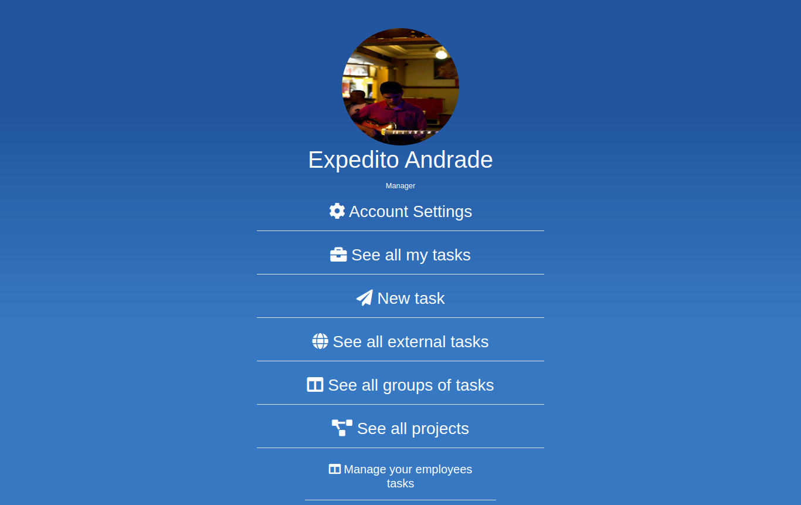

# Task Manager - Manage tasks of your company

<!-- TABLE OF CONTENTS -->

## Table of Contents

- [About the Project](#about-the-project)
  - [Built With](#built-with)
- [Contact](#Authors)
- [Acknowledgements](#acknowledgements)
- [What can it do](#What-can-it-do)

## Description

An app that lets you register tasks and group them in two levels, allowing one class of Users (managers) to keep track and assign tasks to other levels (employees), also allows comunication between them with a live-chat.

## Live demo

## Built With

- Ruby on Rails
- Javascript
- Rspec
- FactoryBot
- Faker
- Bootstrap

## Getting Started

To get a local copy up and running follow these simple example steps.

### Prerequisites

- Ruby on Rails

### Usage

#### Online

- Just open the link and register yourself as an User and enjoy.

#### Locally

- Clone the project to your local machine
- Open your terminal and type in 'rails db:migrate'
- Type 'rails server' on your terminal
- Try out creating a profiler as a manager or employee

## Author

- Expedito Andrade

👤 **Expedito Andrade**

- Github: [@githubexpjazz](https://github.com/expjazz)
- Twitter: [@expjazz](https://twitter.com/expeditoandrade13)
- Linkedin: [Expedito Andrade](https://www.linkedin.com/in/expedito-andrade-3645151a4/)
- Email: expeditojazz@gmail.com

### Future Updates

- To allow more layers of users.
- To give an option of the employee class of the user to initate a chat.
- Restrict the groups from user to user

## 🤝 Contributing

Contributions, issues and feature requests are welcome!

Feel free to check the [issues page](issues/).

## Show your support

Give a ⭐️ if you like this project!

## Acknowledgments

- Microverse, standup team and the microverse community for helping build the skills that were used on this project

## 📝 License

This project is [MIT](lic.url) licensed.
Design by Gregoire Vella on Behance.
